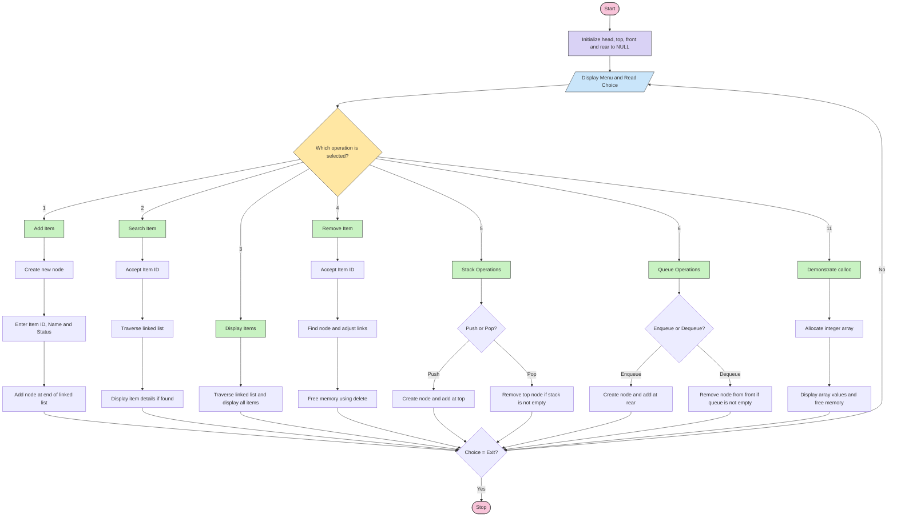

## Flowchart – College Lost & Found Management System

```mermaid
flowchart TD
    A([Start]) --> B[Initialize head, top, front and rear to NULL]
    B --> C[/Display Menu and Read Choice/]
    C --> D{Which operation is selected?}

    D -->|1| E[Add Item]
    E --> E1[Create new node]
    E1 --> E2[Enter Item ID, Name and Status]
    E2 --> E3[Add node at end of linked list]

    D -->|2| F[Search Item]
    F --> F1[Accept Item ID]
    F1 --> F2[Traverse linked list]
    F2 --> F3[Display item details if found]

    D -->|3| G[Display Items]
    G --> G1[Traverse linked list and display all items]

    D -->|4| H[Remove Item]
    H --> H1[Accept Item ID]
    H1 --> H2[Find node and adjust links]
    H2 --> H3[Free memory using delete]

    D -->|5| I[Stack Operations]
    I --> I1{Push or Pop?}
    I1 -->|Push| I2[Create node and add at top]
    I1 -->|Pop| I3[Remove top node if stack is not empty]

    D -->|6| J[Queue Operations]
    J --> J1{Enqueue or Dequeue?}
    J1 -->|Enqueue| J2[Create node and add at rear]
    J1 -->|Dequeue| J3[Remove node from front if queue is not empty]

    D -->|11| K[Demonstrate calloc]
    K --> K1[Allocate integer array]
    K1 --> K2[Display array values and free memory]

    E3 --> L{Choice = Exit?}
    F3 --> L
    G1 --> L
    H3 --> L
    I2 --> L
    I3 --> L
    J2 --> L
    J3 --> L
    K2 --> L

    L -->|No| C
    L -->|Yes| M([Stop])

    style A fill:#f8c4d9,stroke:#333
    style M fill:#f8c4d9,stroke:#333
    style B fill:#d9d2f5,stroke:#333
    style C fill:#c9e5fa,stroke:#333
    style D fill:#ffe7a3,stroke:#333
    style E fill:#c8f2c2,stroke:#333
    style F fill:#c8f2c2,stroke:#333
    style G fill:#c8f2c2,stroke:#333
    style H fill:#c8f2c2,stroke:#333
    style I fill:#c8f2c2,stroke:#333
    style J fill:#c8f2c2,stroke:#333
    style K fill:#c8f2c2,stroke:#333
```

