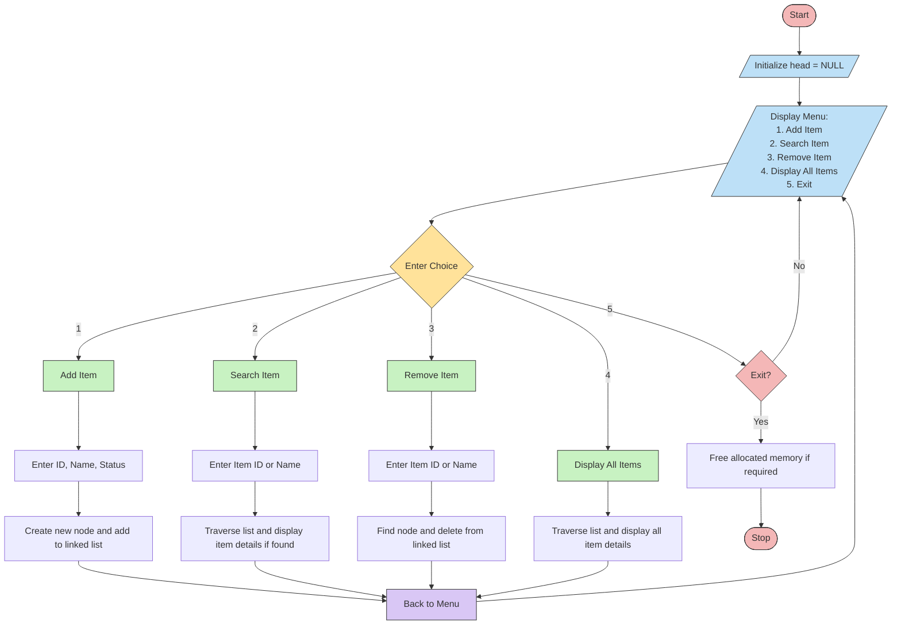

# College Lost & Found Management System
## Flowchart (Using Linked List)

```mermaid
flowchart TD
    A([Start]) --> B[/Initialize head = NULL/]
    B --> C[/Display Menu:<br/>1. Add Item<br/>2. Search Item<br/>3. Remove Item<br/>4. Display All Items<br/>5. Exit/]
    C --> D{Enter Choice}

    D -- 1 --> E[Add Item]
    E --> E1[Enter ID, Name, Status]
    E1 --> E2[Create new node and add to linked list]
    E2 --> M[Back to Menu]

    D -- 2 --> F[Search Item]
    F --> F1[Enter Item ID or Name]
    F1 --> F2[Traverse list and display item details if found]
    F2 --> M

    D -- 3 --> G[Remove Item]
    G --> G1[Enter Item ID or Name]
    G1 --> G2[Find node and delete from linked list]
    G2 --> M

    D -- 4 --> H[Display All Items]
    H --> H1[Traverse list and display all item details]
    H1 --> M

    D -- 5 --> I{Exit?}
    I -- No --> C
    I -- Yes --> J[Free allocated memory if required]
    J --> K([Stop])

    M --> C

    style A fill:#f4b7b7,stroke:#333
    style K fill:#f4b7b7,stroke:#333
    style B fill:#bde0f7,stroke:#333
    style C fill:#bde0f7,stroke:#333
    style D fill:#ffe29a,stroke:#333
    style I fill:#f4b7b7,stroke:#333
    style E fill:#c8f2c2,stroke:#333
    style F fill:#c8f2c2,stroke:#333
    style G fill:#c8f2c2,stroke:#333
    style H fill:#c8f2c2,stroke:#333
    style M fill:#d9c7f5,stroke:#333
```

