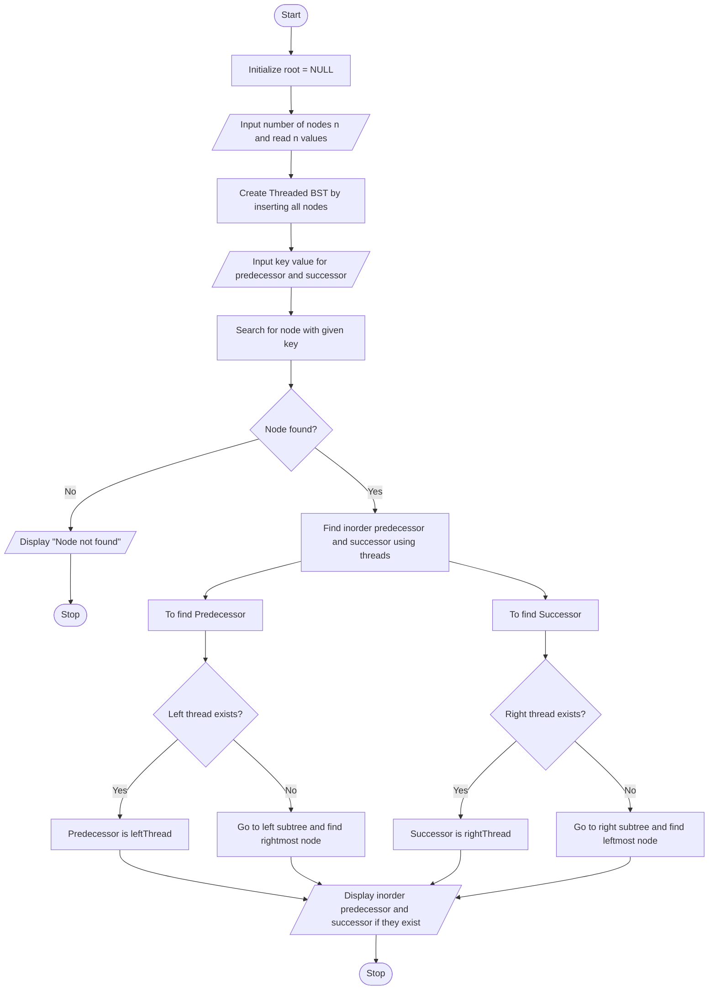

# Flowchart – Threaded BST Predecessor and Successor

## Flowchart

```mermaid
flowchart TD
    A([Start]) --> B[Initialize root = NULL]
    B --> C[/Input number of nodes n and read n values/]
    C --> D[Create Threaded BST by inserting all nodes]
    D --> E[/Input key value for predecessor and successor/]
    E --> F[Search for node with given key]
    F --> G{Node found?}

    G -- No --> H[/Display "Node not found"/]
    H --> I([Stop])

    G -- Yes --> J[Find inorder predecessor and successor using threads]

    J --> K[To find Predecessor]
    J --> L[To find Successor]

    K --> M{Left thread exists?}
    M -- Yes --> N[Predecessor is leftThread]
    M -- No --> O[Go to left subtree and find rightmost node]

    L --> P{Right thread exists?}
    P -- Yes --> Q[Successor is rightThread]
    P -- No --> R[Go to right subtree and find leftmost node]

    N --> S[/Display inorder predecessor and successor if they exist/]
    O --> S
    Q --> S
    R --> S

    S --> T([Stop])
```

