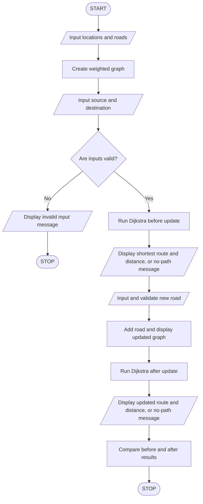

# Dijkstra's Algorithm - Before and After Road Update

```mermaid
flowchart TD
    A([START]) --> B[/Input locations and roads/]
    B --> C[Create weighted graph]
    C --> D[/Input source and destination/]
    D --> E{Are inputs valid?}

    E -- No --> F[/Display invalid input message/]
    F --> X([STOP])

    E -- Yes --> G[Run Dijkstra before update]
    G --> H[/Display shortest route and distance, or no-path message/]
    H --> I[/Input and validate new road/]
    I --> J[Add road and display updated graph]
    J --> K[Run Dijkstra after update]
    K --> L[/Display updated route and distance, or no-path message/]
    L --> M[Compare before and after results]
    M --> N([STOP])
```
