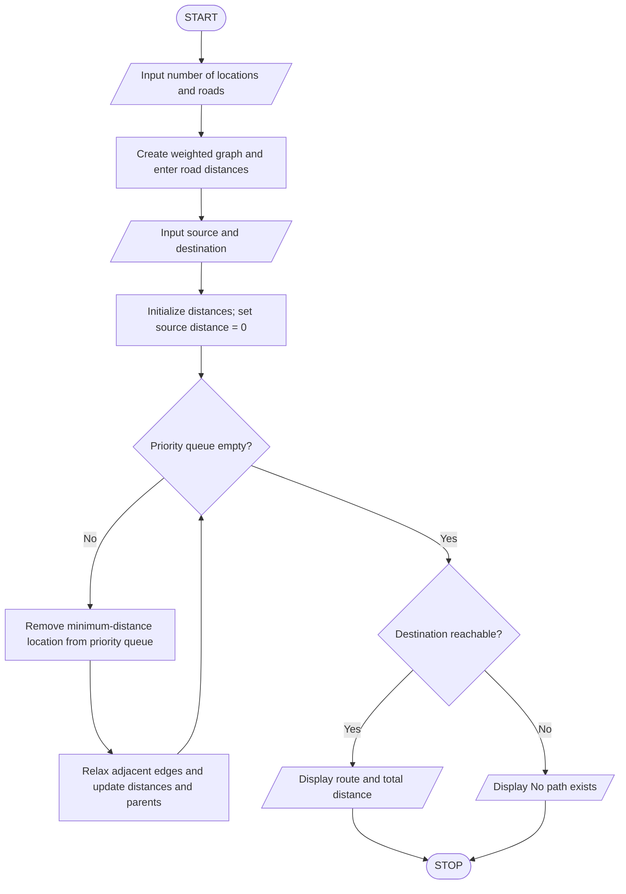

# Shortest Path Finding Algorithm

```mermaid
flowchart TD
    A([START]) --> B[/Input number of locations and roads/]
    B --> C[Create weighted graph and enter road distances]
    C --> D[/Input source and destination/]
    D --> E[Initialize distances; set source distance = 0]
    E --> F{Priority queue empty?}

    F -- No --> G[Remove minimum-distance location from priority queue]
    G --> H[Relax adjacent edges and update distances and parents]
    H --> F

    F -- Yes --> I{Destination reachable?}
    I -- Yes --> J[/Display route and total distance/]
    I -- No --> K[/Display No path exists/]

    J --> L([STOP])
    K --> L
```

